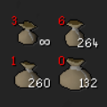

# Essence Pouch Tracking

A RuneLite plugin that tracks both the amount of essence stored in your essence pouches and the amount of essence until decay.

## Features
- Supports all essence kinds of essence and essence pouches
- Shows the amount of essence stored in the essence pouch
- Shows the amount of essence until the decay
- Tracks repairing pouches via [Dark Mage](https://oldschool.runescape.wiki/w/Dark_Mage_(Abyss)) (Abyss or NPC Contact) or GOTR's [Apprentice Cordelia](https://oldschool.runescape.wiki/w/Apprentice_Cordelia#Raiments_of_the_Eye)
- Supports [Guardians of the Rift](https://oldschool.runescape.wiki/w/Guardians_of_the_Rift) (GOTR)

## How to Use the Plugin
1. Install the plugin from the RuneLite [Plugin Hub](https://runelite.net/plugin-hub/) by searching "Essence Pouch Tracking"
    1. _Currently waiting to be released_
2. Check your essence pouch to initialize the pouch's current essence count
3. Attempt to repair your essence pouches with any method you prefer to initialize the pouches' remaining decay count

## Known Issues

 - _Stored count essence **could** be wrong_
   - There were some rare instances in which the stored count **could** be wrong. After hours of testing, I've faced it perhaps once or twice, and one of them was in a 4+ hour session.
 - Different essence types are not tracked separately
   - This is a feature I'm working on supporting in the future (See [#12](https://github.com/Infinitay/essence-pouch-tracking/issues/12))
 - Amount of essence until the decay changing despite 99 RC or [specialized equipment](https://oldschool.runescape.wiki/w/Essence_pouch#:~:text=However%2C%20if%20a,requires%2090%20Firemaking)
    - This is a feature I'm working on supporting in the future (See [#9](https://github.com/Infinitay/essence-pouch-tracking/issues/9))

## What's Different?

The main reason I started working on this plugin was because there wasn't a plugin that more accurately tracked essence pouches. I won't claim that this is 100% accurate, but I will say that I've spent more hours testing the plugin on each iteration. I wanted to be sure that I've fixed most if not every edge case problem.

What makes this plugin different primarily is that it handles multiple actions done in one game tick. Here are some examples of considered and tested cases:

- When emptying/filling one or more pouches within a single game tick.
- When emptying/filling multiple times on a pouch within a single game tick
  - I'm not fast enough to test doing this on multiple pouches at the same time within a single game tick, but I'm confident that it should work
- When quickly emptying pouches and crafting runes
- When quickly filling pouches at a bank

This plugin also supports the GOTR minigame such as by supporting [Guardian essence](https://oldschool.runescape.wiki/w/Guardian_essence) and by clearing pouches on new matches or leaving the area

If you'd like more information, I wrote a reasoning/comparison between this plugin and the other essence pouch plugins when I finished the P.O.C. which you can read more about [here](https://gist.github.com/Infinitay/9ff647e746985d8d2e4ec8e3b183c33e).
